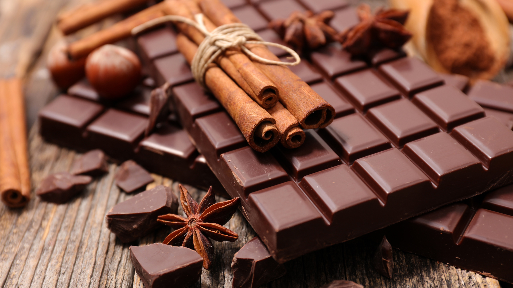
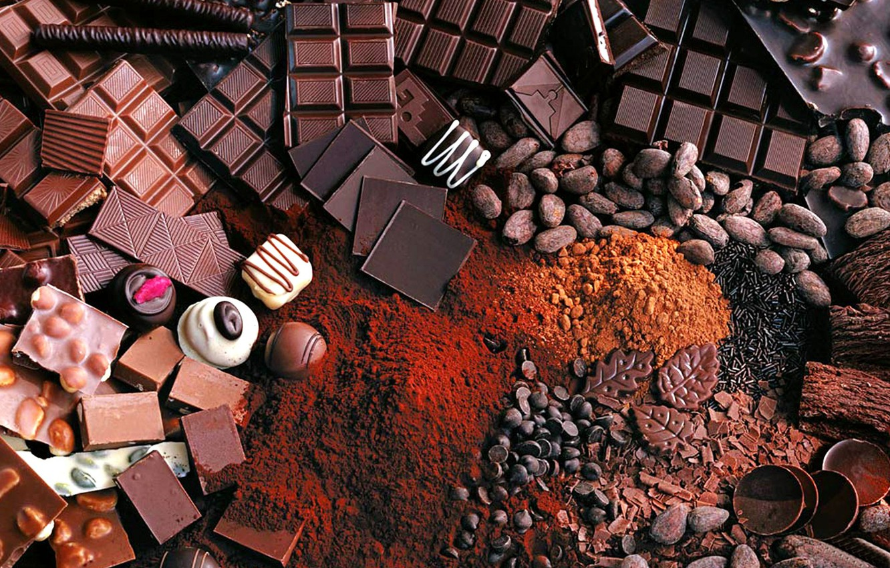
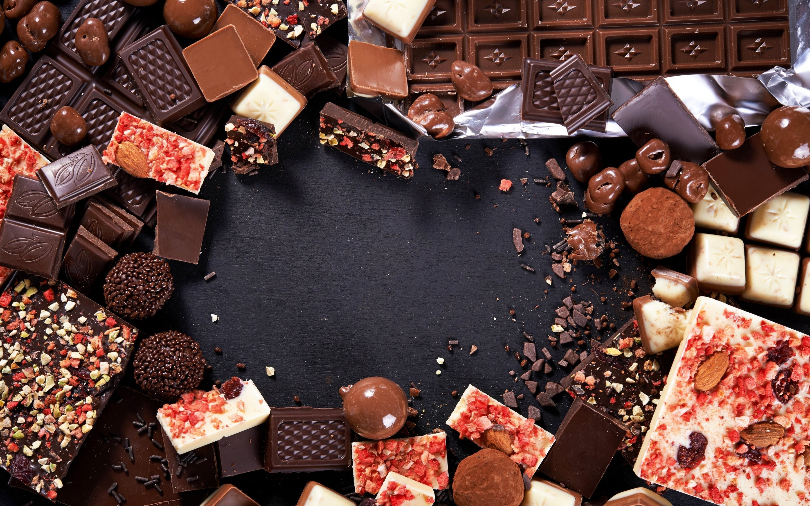

Images
===========

Before we can start coding, we need to have the artwork and other assets. These are merely for prettiness. 

I've chosen some preset colours and font so I can always go back to it. This font is shoould be available by default on Windows and Mac

Main Colour: #7d3f3b
Font: Times Bold
Secondary Colour: #400707

I'll be using these pictures of chocolate I found online and a poorly drawn set of logos.

Background:

    
.. figure:: ./images/powder-chocolate.png
    :height: 256 px
    :align: center
    :alt: chocolate bars with cocoa powder spread on top    

 
Logo:

    
Go to my github repository at the bottom for more variations.

Download the following images from my repository. These all link to the same repository.

Background:
`cinnamon chocolate <https://github.com/matsuru-hoshi/chzklkt-assets/blob/master/website-images/cinamon-chocolate.jpg>`
`chocolate and cocoa powder <https://github.com/matsuru-hoshi/chzklkt-assets/blob/master/website-images/many-chocolates.jpg>`
`chocolate with cocoa powder <https://github.com/matsuru-hoshi/chzklkt-assets/blob/master/website-images/powder-chocolate.png>`
`red chocolate <https://github.com/matsuru-hoshi/chzklkt-assets/blob/master/website-images/red-chocolate.jpg>`

Logo:
https://github.com/matsuru-hoshi/chzklkt-assets/tree/master/logo

